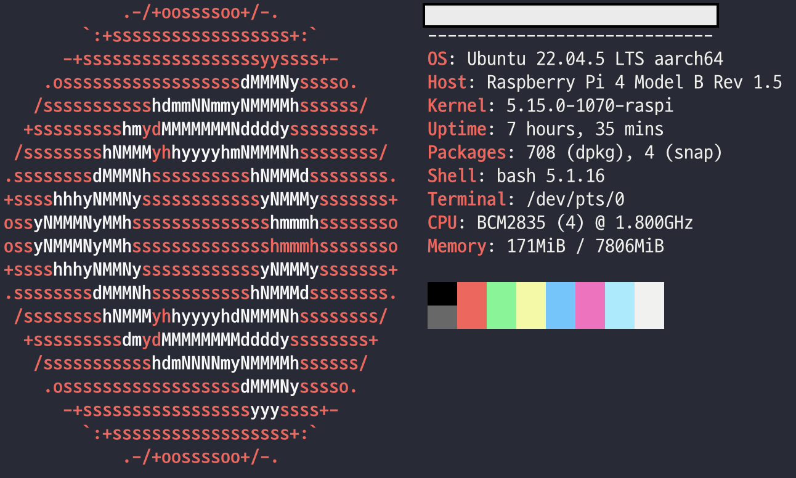
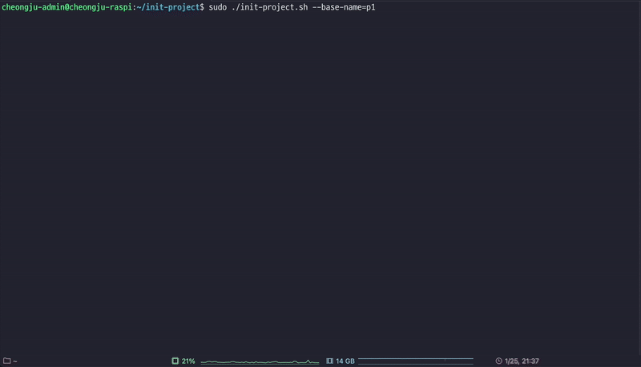

# init-project

Ubuntu 서버에서 `시스템 유저 & 그룹`, `MySQL 데이터 베이스 & 유저` 생성을 자동화하기 위한 쉘 스크립트.

---

# 시스템 정보 & 필요사항

- `neofetch` 를 통한 시스템 정보

<!-- raspi-neofetch.png -->

<p align="center">
    
</p>

- 필요사항

|           |      Usage      | Version |
|:---------:|:---------------:|:-------:|
| `openssl` | 비밀번호 생성을 위한 명령어 |    x    |
|  `MySQL`  |    프로젝트 DBMS    | `8.x+`  |

아래의 명령어가 정상 작동하면 무리없이 실행 가능합니다.

```bash
$ openssl rand -hex 10
$ sudo mysql -e "SELECT user, host FROM mysql.user;"
```

`sudo mysql -e ...` 명령어를 실행하려면 MySQL 에 비밀번호가 없는 `root` 유저가 필요합니다.

MySQL 에서 `root` 의 플러그인을 `auth_socket` 으로 변경하면, `sudo` 권한을 가진 유저만 `sudo mysql -e ...` 명령어를 실행하도록 제한할 수 있습니다.

```mysql
ALTER USER 'root'@'localhost' IDENTIFIED WITH auth_socket BY '';
```

- `auth_socket` 변경 후 `root` 시스템 유저가 명령어를 잘 수행하는 모습

```bash
root@cheongju-raspi:~# mysql -e "SELECT user, host, plugin from mysql.user;"
```

```
+--------------------+-----------+-----------------------+
| user               | host      | plugin                |
+--------------------+-----------+-----------------------+
| root               | %         | caching_sha2_password |
| debian-sys-maint   | localhost | caching_sha2_password |
| mysql.infoschema   | localhost | caching_sha2_password |
| mysql.session      | localhost | caching_sha2_password |
| mysql.sys          | localhost | caching_sha2_password |
| root               | localhost | auth_socket           |
+--------------------+-----------+-----------------------+
```

---

# 기초 사용법

## 프로젝트 초기화 돌리기

`init-project` 는 `sudo` 권한과 같이 실행해야 합니다.

```bash
$ sudo ./init-project.sh --base-name=project
```

이 때 `--base-name` 인자로 프로젝트의 기본 이름을 설정합니다.

`--base-name=project` 로 실행시, 아래의 자원들이 자동으로 생성됩니다.

- 새로운 시스템 (우분투) 유저 `project-admin`
- 새로운 시스템 유저 `project-dev`
- MySQL 데이터베이스 `project_db`
- MySQL 유저 `project_admin`
- MySQL 유저 `project_dev`
- 자원 생성 리포트 `project-config-report.config`
- 프로젝트 삭제 스크립트 `project-removal.sh`

자원 생성 리포트를 통해 어떤 유저가 생성되었는지, 비밀번호는 무엇인지 등을 확인할 수 있습니다.

<details><summary> project-config-report.config 예시</summary>

```
Configuration Report for Project: project
Generated on: Sun Jan 26 15:04:36 KST 2025
Server Public IP: x.x.x.x

1. System Users and Groups:
   Groups:
     - project-group
     - project-admin
     - project-dev

   Users:
     - Username: project-admin
       Password: 7727b1-4cadda-fdee8b
       Groups: project-admin sudo project-group

     - Username: project-dev
       Password: f3bb92-49689d-5bc32d
       Groups: project-dev docker custom-shell-script project-group

2. Database and MySQL Users:
   Database Name: project_db

   Users:
     - Username: project-admin
       Password: 7727b1-4cadda-fdee8b
       Privileges:
         Grants for project-admin@%
         GRANT SELECT, INSERT, UPDATE, DELETE, CREATE, DROP, RELOAD, SHUTDOWN, PROCESS, FILE, REFERENCES, INDEX, ALTER, SHOW DATABASES, SUPER, CREATE TEMPORARY TABLES, LOCK TABLES, EXECUTE, REPLICATION SLAVE, REPLICATION CLIENT, CREATE VIEW, SHOW VIEW, CREATE ROUTINE, ALTER ROUTINE, CREATE USER, EVENT, TRIGGER, CREATE TABLESPACE, CREATE ROLE, DROP ROLE ON *.* TO `project-admin`@`%`
         GRANT APPLICATION_PASSWORD_ADMIN,AUDIT_ABORT_EXEMPT,AUDIT_ADMIN,AUTHENTICATION_POLICY_ADMIN,BACKUP_ADMIN,BINLOG_ADMIN,BINLOG_ENCRYPTION_ADMIN,CLONE_ADMIN,CONNECTION_ADMIN,ENCRYPTION_KEY_ADMIN,FIREWALL_EXEMPT,FLUSH_OPTIMIZER_COSTS,FLUSH_STATUS,FLUSH_TABLES,FLUSH_USER_RESOURCES,GROUP_REPLICATION_ADMIN,GROUP_REPLICATION_STREAM,INNODB_REDO_LOG_ARCHIVE,INNODB_REDO_LOG_ENABLE,PASSWORDLESS_USER_ADMIN,PERSIST_RO_VARIABLES_ADMIN,REPLICATION_APPLIER,REPLICATION_SLAVE_ADMIN,RESOURCE_GROUP_ADMIN,RESOURCE_GROUP_USER,ROLE_ADMIN,SENSITIVE_VARIABLES_OBSERVER,SERVICE_CONNECTION_ADMIN,SESSION_VARIABLES_ADMIN,SET_USER_ID,SHOW_ROUTINE,SYSTEM_USER,SYSTEM_VARIABLES_ADMIN,TABLE_ENCRYPTION_ADMIN,TELEMETRY_LOG_ADMIN,XA_RECOVER_ADMIN ON *.* TO `project-admin`@`%`

     - Username: project-dev
       Password: f3bb92-49689d-5bc32d
       Privileges:
         Grants for project-dev@%
         GRANT USAGE ON *.* TO `project-dev`@`%`
         GRANT ALL PRIVILEGES ON `project_db`.* TO `project-dev`@`%`

3. Additional Information:
   Script executed by: root
   Hostname: ???
```

---

</details>

만약 실행 중 에러가 발생하면 롤백 메커니즘이 작동되며, 이전에 생성했던 모든 자원을 삭제해 서버를 원상복구 시킵니다.

<!-- init-project-fails.gif -->

<p align="center">
    
</p>

위 그림을 보면 빨간색 글자로 에러가 어디에서 발생했는지 보여주고, 노란색 글자로 롤백을 실행하는 것을 확인할 수 있습니다.

만약 에러가 발생하지 않으면 초록색 글자로 자원 생성이 완료되었음을 보여줍니다.

<!-- init-project-success.gif -->

<p align="center">
    
</p>

생성된 유저들은 아래의 그룹 혹은 MySQL 권한을 갖습니다.

- 시스템 (Ubuntu) 유저 : `project-admin`, `project-dev`

|         |     `project-admin`     |       `project-dev`        |
|:-------:|:-----------------------:|:--------------------------:|
| 소속된 그룹들 | `sudo`, `project-group` | `[앱 그룹들]`, `project-group` |

`project-group` 은 프로젝트별 유저를 분리하기 위한 그룹이며, 때문에 두 유저 모두 `project-group` 에 속하는 것을 볼 수 있습니다.

또한 관리자는 `sudo` 그룹을, 개발자는 `[앱 그룹들]` 을 추가로 갖는것을 볼 수 있습니다.

이 때 [`[앱 그룹들]`](./Application-groups.config) 은 Docker, Nginx, Grafana 등 시스템과 연관된 앱을 실행할 수 있게 하기 위한 그룹입니다.

만약 개발자에게 다른 그룹을 부여하고자 하면 아래의 예시처럼 [`[Application groups]`](./Application-groups.config) 수정해야 합니다.


<details><summary> Application-groups.config 예시</summary>

개발자에게 `[앱 그룹들]` 을 부여하는건 [`steps/01-creation/02-assign-groups.sh`](./steps/01-creation/02-assign-groups.sh) 스크립트에서 진행됩니다.

위 과정에서 스크립트는 [`Application-groups.config`](./Application-groups.config) 파일을 한줄씩 읽어 그룹을 확인합니다.

만약 `Application-groups.config` 에 빈 줄이나 빈 문자열이 있으면 이를 무시합니다.

더불어 `Application-groups.config` 에 추가하는 모든 그룹은 이미 시스템에 존재하는 그룹이어야 하고, 그렇지 않으면 에러를 발생시켜 롤백시킵니다.


```
docker

cutsom-shell-script

group-should-already-exists-in-system
```

---

</details>

- MySQL 유저 : `project_admin`, `project_dev`

|            |                  `project_admin`                  |           `project_dev`           |
|:----------:|:-------------------------------------------------:|:---------------------------------:|
| privileges | MySQL 에 존재하는 모든 데이터베이스에 모든 권한을 가짐. `root` 유저와 동일. | `project_db` 데이터베이스 한해 모든 권한을 가짐. |

`project_admin` 은 MySQL 의 모든 privilege 를 가져 `root` 유저와 동일합니다.

반면 `project_dev` 유저는 `project_db` 데이터베이스에 한해 모든 privileges 를 가집니다. 이를 통해 개발자는 프로젝트 DB 에 인덱스를 걸거나 가상 테이블을 만드는 등의 행동을 할 수 있습니다. 


---

## 프로젝트 다시 삭제하기

프로젝트 초기화가 성공적으로 완료되면, 기록했던 롤백 로그들을 `project-removal.sh` 로 복사합니다.

때문에 아래처럼 `project-removal.sh` 를 실행시키면 생성한 모든 자원들을 삭제합니다.

<!-- project-removal.gif -->

<p align="center">
    
</p>

삭제 스크립트는 기록했던 롤백 로그들을 복사할 뿐이므로, 프로젝트 초기화 이후 진행한 설정들은 삭제되지 않을 수 있습니다.


---

## 간단한 시스템 확인 스크립트

프로젝트 초기화 스크립트와 별개로, [`list-users.sh`](./list-users.sh) 와 [`list-groups.sh`](./list-groups.sh), [`list-ssh-logins.sh`](./list-ssh-logins.sh) 스크립트가 존재합니다.

이를 통해 서버에 생성된 유저, 그룹, 현재 SSH 로그인된 유저를 확인할 수 있습니다.

```bash
$ ./list-users.sh
```

```
USERNAME                  PRIORITY GROUP            UID        GID
cheongju-admin            cheongju-admin            1000       1003
project-admin             project-admin             1003       1005
project-dev               project-dev               1004       1004
nobody                    nogroup                   65534      65534
```

```bash
$ ./list-groups.sh
```

```
GROUPNAME                 GID        GROUP MEMBERS
root                      0          No members

︙                        ︙          ︙

sudo                      27         cheongju-admin,project-admin

︙                        ︙          ︙

docker                    999        cheongju-admin,project-dev

︙                        ︙          ︙

project-dev               1004       project-dev,cheongju-admin
project-admin             1005       project-admin,cheongju-admin
project-group             1006       project-admin,project-dev,cheongju-admin
nogroup                   65534      No members
```

```bash
$ ./list-ssh-logins.sh
```

```
USER                PID       STAT      STARTED                        TIME            COMMAND
cheongju-admin      121345    S         Sun Jan 26 14:43:31 2025       00:00:00        sshd
cheongju-admin      121995    S         Sun Jan 26 14:58:34 2025       00:00:00        sshd
root                833       Ss        Tue Jan 21 20:19:44 2025       00:01:51        sshd
root                121257    Ss        Sun Jan 26 14:43:27 2025       00:00:00        sshd
root                121948    Ss        Sun Jan 26 14:58:34 2025       00:00:00        sshd
```

---

# 작동 원리

## [`init-project.sh`](./init-project.sh)

`init-project.sh` 는 2 개의 인자를 받습니다. `--base-name` 과 `--roll-back` 입니다.

|      인자       | 필수 |                설명                 |
|:-------------:|:--:|:---------------------------------:|
| `--base-name` | Y  |         프로젝트 이름으로 사용됩니다.          |
| `--roll-back` | N  | 프로젝트 초기화 중, 롤백 로그를 저장할 위치를 명시합니다. |

인자로 `--roll-back` 가 주어지지 않을 시, `/tmp/[--base-name]-project-init-rollback.log` 로 자동 설정 됩니다.

`init-project.sh` 는 3 가지 역할을 수행합니다.

1. `steps/*/` 에 존재하는 하위 스크립트들을 정렬 순서대로 실행합니다.
2. `--base-name`, `--roll-back` 인자를 하위 스크립트들에게 전달합니다.
3. 실행 중 에러가 발생하면 하위 스크립트 실행을 멈추고 롤백을 실행합니다.

예를 들어 아래 `tree` 구조처럼 스크립트가 존재한다 가정합시다.

```
init-project
├── init-project.sh
├── Application-groups.config
└── steps
    ├── 00-validation
    │   ├── 01-check-directory-user-group-duplicates.sh
    │   └── 02-check-mysql-resources.sh
    ├── 01-creation
    │   ├── 01-create-users.sh
    │   ├── 02-assign-groups.sh
    │   └── 03-create-mysql-resources.sh
    ├── 02-activation
    │   ├── 01-set-profile-timeout.sh
    │   ├── 02-set-home-directory-permission.sh
    │   └── 98-assign-password-and-record-configurations.sh
    └── 99-finish
        └── 99-create-project-removal.sh
```

이 때 `init-project.sh` 는 다음 순서처럼 하위 스크립트를 실행할 것입니다.

- `00-validation/01-...`, `00-validation/02-...`, `(다음 디렉토리로 이동)`
- `01-creation/01-...`, `01-creation/01-...` (생략)

<details><summary> init-project.sh 의 롤백 메커니즘 (shell script)</summary>

```bash
# init-project.sh

# Function to execute all rollbacks
rollback() {
  log_error "Rolling back actions..."
  if [ -f "$ROLLBACK_LOG" ]; then

    tac "$ROLLBACK_LOG" | while read -r cmd; do
      log_warning "Executing rollback command: $cmd"
      eval "$cmd" || log_error "Warning: Rollback command failed: $cmd"
    done
    
    log_warning "Rollback commands were executed. Removing rollback log"
    rm -f "$ROLLBACK_LOG"
    log_warning "Removed rollback log: ${ROLLBACK_LOG}"
  
  fi
  log_error "Rollback completed."
}

# omit

# Execute steps in the "steps" directory
for step_dir in steps/*; do

  if [ -d "$step_dir" ]; then

    echo "" # Add newline
    log "Executing step directory: $step_dir"
    step_count=0

    for step_script in $(ls "$step_dir"/*.sh 2>/dev/null | sort); do
      step_count=$((step_count + 1))
      log "Running step script: $step_script"
      bash "$step_script" --base-name="$BASE_NAME" --roll-back="$ROLLBACK_LOG" || {

        # If error occurr, abrot remaining subscripts
        # and execute rollbacks
        echo ""
        ERR="Error has been occurred at ${step_script}. Triggering rollback."
        SIZE=${#ERR}
        WRAPPER=$(printf "=%.0s" $(seq 1 $((SIZE + 4))))
        log_error " $WRAPPER "
        log_error "|  $ERR  |"
        log_error " $WRAPPER "
        echo ""

        rollback
        exit 1
      }

      log_success "Step $step_script completed successfully."
    done

    if [ "$step_count" -eq 0 ]; then
      log_warning "No scripts found in step directory: $step_dir"
    fi

  fi
done
```

</details>

---

## 하위 스크립트

모든 하위 스크립트는 `--base-name` 와 `--roll-back` 인자를 받아야 합니다.

이는 기본 초기화 뿐만 아니라 각 실행하는 명령어에 반대되는 명령어들 (롤백) 을 기록하기 위함입니다.

```bash
# Parse arguments
for arg in "$@"; do
  case $arg in
    --base-name=*)
      BASE_NAME="${arg#*=}"
      ;;
    --roll-back=*)
      ROLLBACK_LOG="${arg#*=}"
      ;;
    *)
      log_error "Unknown argument: $arg"
      echo "Usage: $0 --base-name=PROJECT_BASENAME [--roll-back=ROLLBACK_LOG]"
      exit 1
      ;;
  esac
done
```

하위 스크립트 내 `시스템 유저, 그룹` 등 같은 자원을 건드리는 명령어가 존재할 것 입니다.

이 때 각각의 명령어를 수행하고 그에 반대되는 롤백을 반드시 기록하셔야 합니다. 그렇지 않으면 롤백이 진행되도 시스템 자원이 남아있을 수 있습니다.

예를 들어 [`steps/01-creation/01-create-user.sh`](./steps/01-creation/01-create-users.sh) 에는 `관리자 유저`, `개발자 유저` 를 만드는 부분이 존재합니다.

이는 아래에서 볼 수 있듯 `useradd` 명령어를 이용합니다.

```bash
# 01-create-users.sh

record_rollback() {
  echo "$1" >> "$ROLLBACK_LOG"
}

# Create admin user & project home directory for project
log "Creating users for project: $BASE_NAME"
useradd -m -d "/home/$BASE_NAME" -s /bin/bash "${BASE_NAME}-admin"
record_rollback "userdel -r ${BASE_NAME}-admin"

# Create dev user for project
useradd -m -d "/home/$BASE_NAME" -s /bin/bash "${BASE_NAME}-dev"
record_rollback "userdel ${BASE_NAME}-dev"
```

하지만 `useradd` 명령어 후, `record_rollback` 를 통해 이전 수행한 명령어와 반대되는 명령어를 기록하고 있습니다.

이를 통해 하위 스크립트 실행 중 에러가 발생해도 생성한 자원들을 모두 삭제시키는 것이 가능합니다.

---

## 스크립트 모듈화

`init-project` 는 다음과 같은 구조를 갖고 있습니다.

```
init-project
├── init-project.sh
└── steps
    ├── 00-validation
    ├── 01-creation
    ├── 02-activation
    └── 99-finish
```

이전에 언급했듯, `init-project.sh` 는 `00-validation`, `01-creation` 등의 내부에 존재하는 하위 스크립트를 실행합니다.

이 때 하위 스크립트를 정렬해 실행하듯, `init-project.sh` 는 `steps` 아래 하위 디렉토리를 정렬 순서대로 접근합니다.

때문에 추후 또다른 기능이 필요해졌을 시, 아래처럼 새로운 하위 디렉토리를 만들고 스크립트를 넣음으로서 각 스크립트간 실행 순서를 보장할 수 있습니다.

```
init-project
├── init-project.sh
└── steps
    ├── 00-validation
    ├── 01-creation
    ├── 02-activation
    ├── 10-new-feature
    └── 99-finish
```

하위 스크립트, 하위 디렉토리 정렬은 아래처럼 `sort` 명령어를 이용합니다.

```bash
# init-project.sh

# Execute steps in the "steps" directory
for step_dir in steps/*; do

  if [ -d "$step_dir" ]; then

    echo "" # Add newline
    log "Executing step directory: $step_dir"
    step_count=0

    for step_script in $(ls "$step_dir"/*.sh 2>/dev/null | sort); do
      step_count=$((step_count + 1))
      log "Running step script: $step_script"
      bash "$step_script" --base-name="$BASE_NAME" --roll-back="$ROLLBACK_LOG" || {

        echo ""
        ERR="Error has been occurred at ${step_script}. Triggering rollback."
        SIZE=${#ERR}
        WRAPPER=$(printf "=%.0s" $(seq 1 $((SIZE + 4))))
        log_error " $WRAPPER "
        log_error "|  $ERR  |"
        log_error " $WRAPPER "
        echo ""

        rollback
        exit 1
      }

      log_success "Step $step_script completed successfully."
    done

    if [ "$step_count" -eq 0 ]; then
      log_warning "No scripts found in step directory: $step_dir"
    fi

  fi
done
```

---