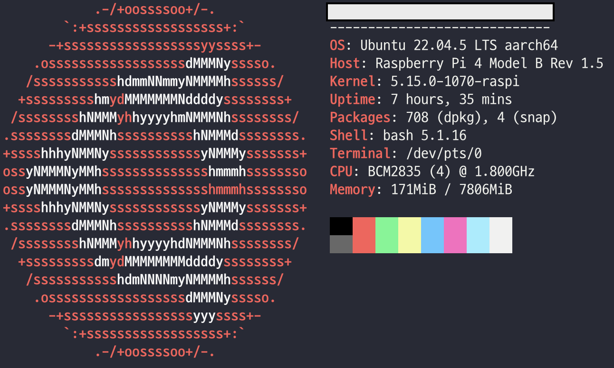
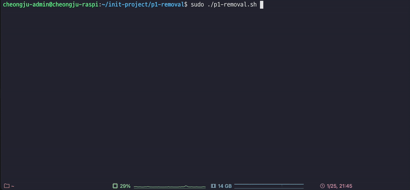

# init-project

Shell scripts to automate `system user and group creation`, `MySQL database and user creation` for backend projects in my Ubuntu server.

- [README kor](./README-kor.md)

---

# System information & Requirements

- System info via `neofetch`

<!-- raspi-neofetch.png -->

<p align="center">
    
</p>

- Requirements

|           |         Usage          | Version |
|:---------:|:----------------------:|:-------:|
| `openssl` | Generate user password |    x    |
|  `MySQL`  |    DBMS for project    | `8.x+`  |

If you are available to execute the following commands, you're good to go.

```bash
$ openssl rand -hex 10
$ sudo mysql -e "SELECT user, host FROM mysql.user;"
```

Inorder to run `sudo mysql -e ...`, MySQL needs a `root` user with empty password.

By changing `root` users' plugin to `auth_socket`, you can restrict un-sudo privileged user to execute `mysql -e`

```mysql
ALTER USER 'root' IDENTIFIED WITH auth_socket BY '';
```

---

# Basic usage

## Initialize project

You should run `init-project` via `sudo` privilege.

```bash
$ sudo ./init-project.sh --base-name=[project]
```

Passing `--base-name=project`, the following resources will be created.

- New ubuntu user `project-admin`
- New ubuntu user `project-dev`
- MySQL database `project_db`
- MySQL user `project_admin`
- MySQL user `project_dev`
- Configuration report `project-config-report.config`
- Project removal script `project-removal.sh`

You can see a configuration report to check which users have been created, what password they have, and what groups they're in.

<details><summary> project-config-report.config example</summary>

```
Configuration Report for Project: project
Generated on: Sun Jan 26 15:04:36 KST 2025
Server Public IP: x.x.x.x

1. System Users and Groups:
   Groups:
     - project-group
     - project-admin
     - project-dev

   Users:
     - Username: project-admin
       Password: 7727b1-4cadda-fdee8b
       Groups: project-admin sudo project-group

     - Username: project-dev
       Password: f3bb92-49689d-5bc32d
       Groups: project-dev docker custom-shell-script project-group

2. Database and MySQL Users:
   Database Name: project_db

   Users:
     - Username: project-admin
       Password: 7727b1-4cadda-fdee8b
       Privileges:
         Grants for project-admin@%
         GRANT SELECT, INSERT, UPDATE, DELETE, CREATE, DROP, RELOAD, SHUTDOWN, PROCESS, FILE, REFERENCES, INDEX, ALTER, SHOW DATABASES, SUPER, CREATE TEMPORARY TABLES, LOCK TABLES, EXECUTE, REPLICATION SLAVE, REPLICATION CLIENT, CREATE VIEW, SHOW VIEW, CREATE ROUTINE, ALTER ROUTINE, CREATE USER, EVENT, TRIGGER, CREATE TABLESPACE, CREATE ROLE, DROP ROLE ON *.* TO `project-admin`@`%`
         GRANT APPLICATION_PASSWORD_ADMIN,AUDIT_ABORT_EXEMPT,AUDIT_ADMIN,AUTHENTICATION_POLICY_ADMIN,BACKUP_ADMIN,BINLOG_ADMIN,BINLOG_ENCRYPTION_ADMIN,CLONE_ADMIN,CONNECTION_ADMIN,ENCRYPTION_KEY_ADMIN,FIREWALL_EXEMPT,FLUSH_OPTIMIZER_COSTS,FLUSH_STATUS,FLUSH_TABLES,FLUSH_USER_RESOURCES,GROUP_REPLICATION_ADMIN,GROUP_REPLICATION_STREAM,INNODB_REDO_LOG_ARCHIVE,INNODB_REDO_LOG_ENABLE,PASSWORDLESS_USER_ADMIN,PERSIST_RO_VARIABLES_ADMIN,REPLICATION_APPLIER,REPLICATION_SLAVE_ADMIN,RESOURCE_GROUP_ADMIN,RESOURCE_GROUP_USER,ROLE_ADMIN,SENSITIVE_VARIABLES_OBSERVER,SERVICE_CONNECTION_ADMIN,SESSION_VARIABLES_ADMIN,SET_USER_ID,SHOW_ROUTINE,SYSTEM_USER,SYSTEM_VARIABLES_ADMIN,TABLE_ENCRYPTION_ADMIN,TELEMETRY_LOG_ADMIN,XA_RECOVER_ADMIN ON *.* TO `project-admin`@`%`

     - Username: project-dev
       Password: f3bb92-49689d-5bc32d
       Privileges:
         Grants for project-dev@%
         GRANT USAGE ON *.* TO `project-dev`@`%`
         GRANT ALL PRIVILEGES ON `project_db`.* TO `project-dev`@`%`

3. Additional Information:
   Script executed by: root
   Hostname: ???
```

---

</details>

If an error has occurred during script running, it triggers a rollback mechanism, so that revert the system to the original state.

<!-- init-project-fails.gif -->

<p align="center">
    
</p>

You can see the red characters showing which script has an error, and executing rollbacks with yellow characters above.

If no error has occurred, it shows green character at the end that initialization has been completed.

<!-- init-project-success.gif -->

<p align="center">
    
</p>


Each user will have group or privileges in MySQL like below.

- System users : `project-admin`, `project-dev`

|        |      `project-admin`      |               `project-dev`               |
|:------:|:-------------------------:|:-----------------------------------------:|
| Groups | `sudo`, `[project]-group` | `[Application groups]`, `[project]-group` |

As you can see, both users are bounded to group `project-group`.

`project-admin` has `sudo` privilege, but `project-dev` does not.

The [`[Application groups]`](./Application-groups.config) is a set of groups that enables to execute certain application on the system, such as Docker, Nginx, Grafana, etc.

If you want to add more groups on `project-dev`, edit [`[Application groups]`](./Application-groups.config) like below.

<details><summary> Application-groups.config example</summary>

Assigning application groups are executed by [`steps/01-creation/02-assign-groups.sh`](./steps/01-creation/02-assign-groups.sh) script.

It parses each line to identify groups.

If an empty string exists in a line, the script will gently ignore it.

And further, every group in file should exist in the system. If not, it will raise error.

```
docker

cutsom-shell-script

group-should-already-exists-in-system
```

---

</details>

- MySQL users : `project_admin`, `project_dev`

|            |                         `project_admin`                         |              `project_dev`               |
|:----------:|:---------------------------------------------------------------:|:----------------------------------------:|
| privileges | All privileges on every database in MySQL. Same as `root` user. | All privileges on `project_db` database. |

`project_admin` has all privileges to MySQL, so it's equal to `root` user.

However, the privileges of `project_dev` is limited on `project_db`. So they can make index, virtual tables, or something else only at `project_db` database.

---

## Remove project

After project initialization, the rollback logs will be copied to `project-removal.sh`.

By executing `project-removal.sh` like below, you can remove all project related resources in your system.

<!-- project-removal.gif -->

<p align="center">
    
</p>

Since the removal script is just a copy of rollback logs, some additional actions after project initialization may remain on your system.

---

## Brief system overview

Additionally, you can use [`list-users.sh`](./list-users.sh) and [`list-groups.sh`](./list-groups.sh) to see which users & groups exist in your system.

```bash
$ ./list-users.sh
```

```
USERNAME                  PRIORITY GROUP            UID        GID
cheongju-admin            cheongju-admin            1000       1003
project-admin             project-admin             1003       1005
project-dev               project-dev               1004       1004
nobody                    nogroup                   65534      65534
```

```bash
$ ./list-groups.sh
```

```
GROUPNAME                 GID        GROUP MEMBERS
root                      0          No members

︙                        ︙          ︙

sudo                      27         cheongju-admin,project-admin

︙                        ︙          ︙

docker                    999        cheongju-admin,project-dev

︙                        ︙          ︙

project-dev               1004       project-dev,cheongju-admin
project-admin             1005       project-admin,cheongju-admin
project-group             1006       project-admin,project-dev,cheongju-admin
nogroup                   65534      No members
```

---

# Overall mechanism

## [`init-project.sh`](./init-project.sh)

`init-project.sh` receive two parameters, `--base-name` & `--roll-back`.

`--base-name` is essential, but `--roll-back` is optional, default `/tmp/[--base-name]-project-init-rollback.log`.

`init-project.sh` serves only three roles.

1. Execute subscripts in `steps/*/` directory in sorted order.
2. Pass `--base-name` & `--roll-back` parameter to subscripts.
3. If an error has occurred, abort all remaining subscripts, and execute rollbacks.

For example, if scripts are configured like below, `init-project.sh` will execute subscripts on this order.

- `00-validation/01-...`, `00-validation/02-...`
- `01-creation/01-...`, `01-creation/01-...` and so on.

```
init-project
├── init-project.sh
├── Application-groups.config
└── steps
    ├── 00-validation
    │   ├── 01-check-directory-user-group-duplicates.sh
    │   └── 02-check-mysql-resources.sh
    ├── 01-creation
    │   ├── 01-create-users.sh
    │   ├── 02-assign-groups.sh
    │   └── 03-create-mysql-resources.sh
    ├── 02-activation
    │   ├── 01-set-profile-timeout.sh
    │   ├── 02-set-home-directory-permission.sh
    │   └── 98-assign-password-and-record-configurations.sh
    └── 99-finish
        └── 99-create-project-removal.sh
```

<details><summary> Basic rollback mechanism in init-project.sh</summary>

```bash
# init-project.sh

# Function to execute all rollbacks
rollback() {
  log_error "Rolling back actions..."
  if [ -f "$ROLLBACK_LOG" ]; then

    tac "$ROLLBACK_LOG" | while read -r cmd; do
      log_warning "Executing rollback command: $cmd"
      eval "$cmd" || log_error "Warning: Rollback command failed: $cmd"
    done
    
    log_warning "Rollback commands were executed. Removing rollback log"
    rm -f "$ROLLBACK_LOG"
    log_warning "Removed rollback log: ${ROLLBACK_LOG}"
  
  fi
  log_error "Rollback completed."
}

# omit

# Execute steps in the "steps" directory
for step_dir in steps/*; do

  if [ -d "$step_dir" ]; then

    echo "" # Add newline
    log "Executing step directory: $step_dir"
    step_count=0

    for step_script in $(ls "$step_dir"/*.sh 2>/dev/null | sort); do
      step_count=$((step_count + 1))
      log "Running step script: $step_script"
      bash "$step_script" --base-name="$BASE_NAME" --roll-back="$ROLLBACK_LOG" || {

        # If error occurr, abrot remaining subscripts
        # and execute rollbacks
        echo ""
        ERR="Error has been occurred at ${step_script}. Triggering rollback."
        SIZE=${#ERR}
        WRAPPER=$(printf "=%.0s" $(seq 1 $((SIZE + 4))))
        log_error " $WRAPPER "
        log_error "|  $ERR  |"
        log_error " $WRAPPER "
        echo ""

        rollback
        exit 1
      }

      log_success "Step $step_script completed successfully."
    done

    if [ "$step_count" -eq 0 ]; then
      log_warning "No scripts found in step directory: $step_dir"
    fi

  fi
done
```

</details>

---

## `subscripts`

All subscripts should receive `--base-name` & `--roll-back` parameters, inorder to record rollback actions.

```bash
# Parse arguments
for arg in "$@"; do
  case $arg in
    --base-name=*)
      BASE_NAME="${arg#*=}"
      ;;
    --roll-back=*)
      ROLLBACK_LOG="${arg#*=}"
      ;;
    *)
      log_error "Unknown argument: $arg"
      echo "Usage: $0 --base-name=PROJECT_BASENAME [--roll-back=ROLLBACK_LOG]"
      exit 1
      ;;
  esac
done
```

In subscripts, there will be commands that interact with system resources like user, group, etc.

However, you should not forget to pass an opposite command to rollback log. If not, related resources will remain even error arises in further.

For example, [`steps/01-creation/01-create-user.sh`](./steps/01-creation/01-create-users.sh) creates system users on server. It creates users by `useradd` command like below.

```bash
# 01-create-users.sh

record_rollback() {
  echo "$1" >> "$ROLLBACK_LOG"
}

# Create admin user & project home directory for project
log "Creating users for project: $BASE_NAME"
useradd -m -d "/home/$BASE_NAME" -s /bin/bash "${BASE_NAME}-admin"
record_rollback "userdel -r ${BASE_NAME}-admin"

# Create dev user for project
useradd -m -d "/home/$BASE_NAME" -s /bin/bash "${BASE_NAME}-dev"
record_rollback "userdel ${BASE_NAME}-dev"
```

As you can see above, after each `useradd ...` command, an opposite command is tossed to `$ROLLBACK_LOG`.

So even if error occurs further, it will "undo" executed commands like `useradd ...` or something.

---

## Script modularization

`init-project` has structure like below.

```
init-project
├── init-project.sh
└── steps
    ├── 00-validation
    ├── 01-creation
    ├── 02-activation
    └── 99-finish
```

As I mentioned before, `init-project.sh` opens subscripts at `00-validation`, `01-creation`, etc.

Just as `init-project.sh` read subscripts in order, `init-project.sh` access subdirectories in order as well.

So if you want another feature, all you need to do is make new subdirectory, and put subscript in it.

```
init-project
├── init-project.sh
└── steps
    ├── 00-validation
    ├── 01-creation
    ├── 02-activation
    ├── 10-new-feature
    └── 99-finish
```

You can redefine subdirectory orderings as you wish.

---